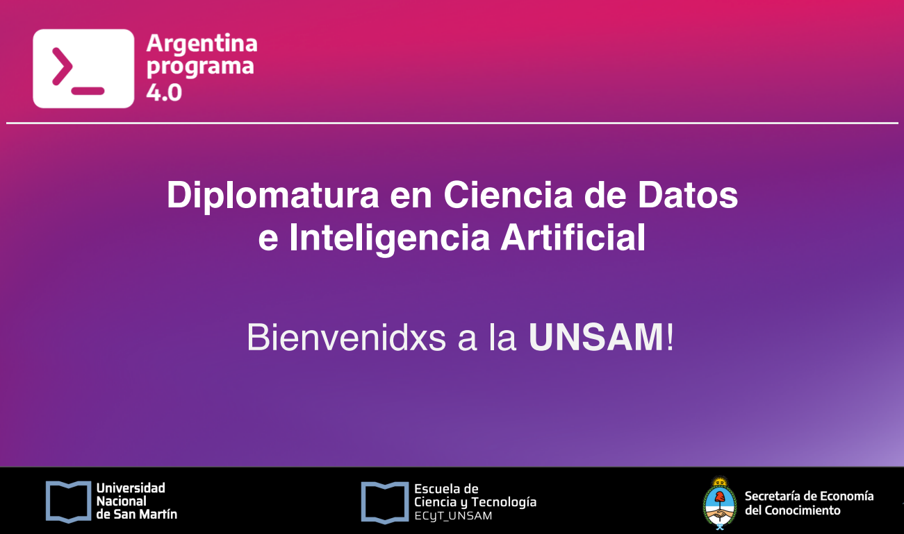
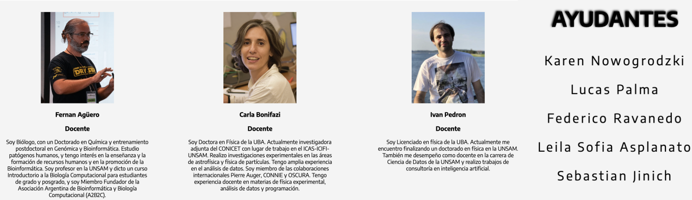

# **`Diplomatura en ciencia de datos e inteligencia artificial`** 
# *`UNSAM (Universidad Nacional de San Martín)`* 

### **`Nahuel-DevOne⚡`**

## **Información:**

Se inicia con un curso de Python para aprender el lenguaje en el que se va a trabajar. Posteriormente, se conocen sus librerías para introducirse en la ciencia de datos, y en el último tramo, el aprendizaje automático.

### La diplomatura consiste en tres módulos:
- "Introducción" | `Programación en Python`
- "Intermedio" | `Ciencia de datos`
- "Especialización" | `Aprendizaje automático`  

### **Módulo 1 | Programación en Python**
-----------------------------------------
1. El entorno y las variables: Diferentes entornos de programación Python (consola, IDE, 
notebooks). Sintaxis del lenguaje. Tipos de datos básicos. Funciones y su documentación.
2. Estructuras de control: Condicionales. Iteraciones. Comprehensión de listas. Recursión.
3. Estructuras de datos: Diccionarios, listas, tuplas, vectores, matrices y árboles.
4. Programación orientada a objetos: Concepto de objeto. Métodos. Herencia.
5. Python para el análisis de datos: Archivos de entrada/salida. Cómputo de estadísticos. 
Regresión lineal. 
6. Visualización de datos. Aplicaciones con Numpy, SciPy y Matplotlib.
7. Testeo y Debuggeo de programas: Diseño de experimentos. Manejos de excepciones. 
Control de flujos.
8. Introducción a la complejidad de algoritmos: Concepto de complejidad. Algoritmos de 
búsqueda. Algoritmos de ordenamiento.

### **Módulo 2 | Ciencia de Datos**
-----------------------------------

- `Elementos de matemática y probabilidad` 

1. Elementos de Cálculo y Algebra. Funciones. Vectores y Matrices. Nociones de derivadas 
e integrales.
2. Definición de probabilidad. Probabilidad conjunta, marginal y condicional. Leyes de la 
probabilidad.
3. La interpretación frecuentista y bayesiana de la probabilidad.
4. Distribuciones especiales: Binomial, Poisson, Gaussiana.
5. Estimadores, estimación de máxima verosimilitud.

- `Análisis Exploratorio de Datos`

1. Programación, exploración y visualización de datos: histogramas, gráficos de caja, 
gráficos qq, gráficos de dispersión. Librerías de Python.
2. Preparación de datos; imputación de valores perdidos; codificación de variables 
categóricas.
3. Técnicas de reducción de la dimensionalidad. Análisis de componentes principales. 
4. Algoritmos de clustering (aprendizaje no supervisado): K-means, K-vecinos más 
cercanos.

- `Introducción al aprendizaje automático`

5. Fundamentos del aprendizaje automático.
6. Entrenamiento, validación y prueba. Selección, extracción e ingeniería de 
características.
7. Overfitting y Cross-validation. K-folding y leave-one-out CV
8. Modelos de regresión. Regresión lineal y regresión polinómica.
9. Modelos de regresión regularizada.
10. Modelos de clasificación. Perceptrón, regresión logística y árboles de decisión.

### **Módulo 3 | Aprendizaje automático**
------------------------------------------

- `Algoritmos avanzados de aprendizaje automático`

1. Support Vector Machines. 
2. Equilibrio sesgo-varianza.
3. Métodos de ensamble. Bagging y stacking. Random Forest.
4. Métodos de Boosting. Métodos de árboles. Gradient Boosting.

- `Redes neuronales`

5. Redes neuronales feed-forward. Métodos de Deep Learning.
6. Entrenamiento de redes. Regularización.
7. Redes neuronales convolucionales en aprendizaje de imágenes.
8. Interpretabilidad. Aprendizaje por transferencia.

- `Deep Learning y aplicaciones`

9. Autoenconders. Autoenconders variacionales. Redes Generativas Antagónicas (GANs).
10.  Redes neuronales recurrentes.
11.  Reinforcement Learning.
12.  Procesamiento de Texto y Lenguaje Natural.
13.  Aplicaciones en contextos comerciales, científicos, financieros, médicos y otros.

## *`Proyecto`* (En proceso)

- 

<!-- - No tiene incorporada ninguna base de datos -->

## **Equipo Docente y ayudantes:**

## **Desarrollado con:**

- [Visual Studio Code](https://code.visualstudio.com/)
- [Colab](https://colab.research.google.com/)
- [Jupyter](https://jupyter.org/)
- [Python](https://www.python.org/)

<!-- Hecho con amor -->
Hecho con ❤️ `Nahuel-DevOne`

